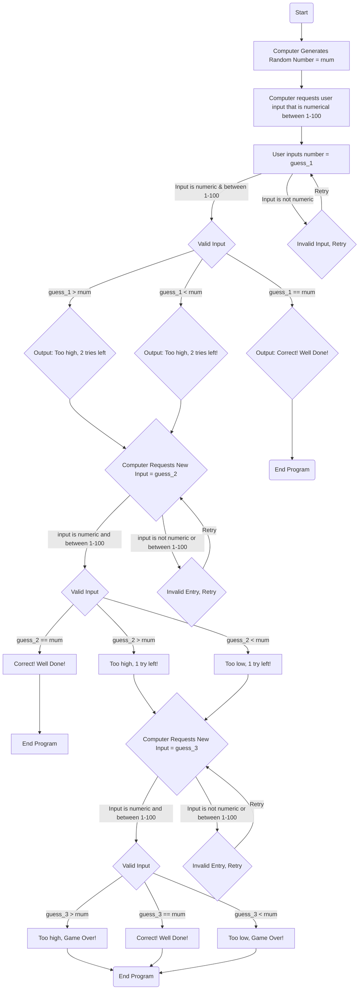

# Flowchart for the Guessing Game of the year, Numeran

## Explanation of the Game

The game begins with the computer randomly generating a number, once it has done so, the user will have three tries to make a correct guess on the number and each time the person makes a guess the computer will determine if the guess is too high, too low or correct. If too high or too low the program will move onto the next guess, however if correct it will display **"Correct! Well Done!"** and end the program. 

### The following is a step by step explanation of the process which the flowchart shows. 

The program goes through three steps during the process of determining if the user has guessed the correct number or not and how to handle. The game begins when the computer has generated a random number (=rnum) and then asks the user to input a guess. 

1. Guess Validation
   a. The user inputs a guess (=guess_1), which then goes through validation
   b. If the input is not a number or not between 1-100, then validation fails and the computer requests a new input
   c. If the input is a number between 1-100 the program proceeds to the next step.

3. Comparison of Correctness
   a. The user input is compared to the random number generated (=rnum).
   b. If the user input guess_1 is greater than rnum then the computer output is _"Too High, 2 tries left!"_
   c. If the user input guess_1 is less than rnum then the computer output is _"Too Low, 2 tries left!"_
   d. If the user input guess_1 is equal to rnum then the computer output is _"Correct! Well Done!"_

4. Game Proceeds
   a. If the initial guess_1 was either too high or too low, the computer then requests a new input (guess_2) and goes through the program again starting at guess validation process.
   b. If guess_2 was also either too high or too low, the computer will output _"Too High/Low, 1 try left!"_ and will then ask for another input (guess_3).

5. The game ends if the following conditions are met:
   a. If guess_1 is correct, the program ends after _"Correct! Well Done"_ output is displayed.
   b. If guess_2 is correct, the program ends after _"Correct! Well Done"_ output is displayed.
   c. No matter the outcome of guess_3 the program will end and will need to be re-started. 

